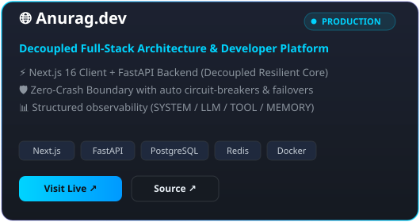
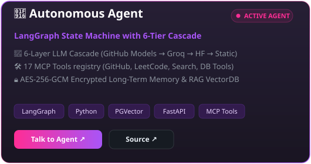
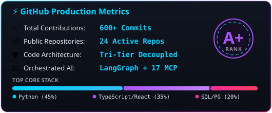

<!-- HERO BANNER -->
<p align="center">
  
</p>

<br>

<!-- TYPING ANIMATION -->
<p align="center">
  
</p>

<br>

<!-- SOCIAL & QUICK LINKS -->
<p align="center">
  <a href="https://cortex-anurag.vercel.app"></a>&nbsp;&nbsp;
  <a href="https://anuragbasuri.vercel.app/portfolio"></a>&nbsp;&nbsp;
  <a href="https://anuragbasuri.vercel.app/resume"></a>&nbsp;&nbsp;
  <a href="https://linkedin.com/in/anuragbasuri"></a>&nbsp;&nbsp;
  <a href="mailto:anuragbasuri@gmail.com"></a>&nbsp;&nbsp;
  
</p>

<br>

<!-- 🤖 AGENT CTA -->
<p align="center">
  <sub>💡 <b>I built an autonomous AI agent that answers questions about me in real-time. Try it:</b></sub>
</p>

<p align="center">
  <a href="https://cortex-anurag.vercel.app">
    
  </a>
</p>

<p align="center">
  <sub>Powered by LangGraph · 6-Layer LLM Cascade · 17 MCP Tools · RAG over my portfolio · Persistent memory</sub>
</p>

<br>

<!-- DIVIDER -->
<p align="center">
  
</p>

<br>

<!-- SYSTEM SPECIFICATIONS / TERMINAL -->
<h2 align="center">System Kernel &amp; Architecture</h2>

<p align="center">
  
</p>

<br>

<!-- ARCHITECTURE CONSTELLATION MAP -->
<p align="center">
  
</p>

<br>

<!-- ABOUT: THE STACK TRACE -->
<h2 align="center">The Stack Trace</h2>

<p align="center">
  <sub>How we got here, in four commits.</sub>
</p>

<br>

```
  ┌─ v1.0 ─── CS undergrad. First Hello World.
  ├─ v2.0 ─── Full-stack shipped: React, Next.js, Node.js, Express
  ├─ v3.0 ─── Freelanced. Architected a platform serving 2000+ users.
  └─ v4.0 ─── Applied AI: LangGraph agents, RAG pipelines, MCP tooling — in production.
```

<br>

<p align="center">
  <sub>Not "can an LLM answer this?" — but "can I build the system that ships one into production safely, cheaply, and reliably?"</sub>
</p>

<br>

<!-- DIVIDER -->
<p align="center">
  
</p>

<br>

<!-- FEATURED PROJECTS (GLOW CARDS) -->
<h2 align="center">What I've Built</h2>

<br>

<p align="center">
  <a href="https://anuragbasuri.vercel.app/portfolio">
    
  </a>
  &nbsp;
  <a href="https://cortex-anurag.vercel.app">
    
  </a>
</p>

<br>

<!-- DIVIDER -->
<p align="center">
  
</p>

<br>

<!-- TECH STACK -->
<h2 align="center">Tech Stack</h2>

<br>

<p align="center">
  <b>Languages &amp; Core Frameworks</b>
</p>

<p align="center">
  
</p>

<br>

<p align="center">
  <b>AI &amp; Agent Systems</b>
</p>

<p align="center">
  
  
  
  
  
</p>

<br>

<p align="center">
  <b>Data &amp; Infrastructure</b>
</p>

<p align="center">
  
</p>

<br>

<details>
<summary><b>Also comfortable with</b> — classical ML/DL foundations</summary>

<br>

<p align="center">
  
</p>

<p align="center">
  <sub>Deep Learning Certified (IIT Ropar / NPTEL). Solid grounding in CNNs, NLP, and Computer Vision — but these days I'd rather architect the system a model lives inside than tune the model itself.</sub>
</p>

</details>

<br>

<!-- DIVIDER -->
<p align="center">
  
</p>

<br>

<!-- STATS & ACTIVITY -->
<h2 align="center">Numbers &amp; Activity</h2>

<br>

<p align="center">
  
  
  
  
</p>

<br>

<p align="center">
  
  &nbsp;
  
</p>

<br>

<p align="center">
  
</p>

<br>

<!-- SNAKE CONTRIBUTION ANIMATION -->
<p align="center">
  <picture>
    <source media="(prefers-color-scheme: dark)" srcset="https://github.com/Anurag-Basuri/Anurag-Basuri/blob/output/github-contribution-grid-snake-dark.svg" />
    <source media="(prefers-color-scheme: light)" srcset="https://github.com/Anurag-Basuri/Anurag-Basuri/blob/output/github-contribution-grid-snake.svg" />
    
  </picture>
</p>

<br>

<!-- 🎵 SPOTIFY NOW PLAYING -->
<h2 align="center">Now Playing</h2>

<br>

<p align="center">
  <a href="https://open.spotify.com/user/31b3dmw5x5kczlxylpjbcxwj3cua">
    
  </a>
</p>

<br>

<!-- 💬 RANDOM DEV QUOTE -->
<p align="center">
  
</p>

<br>

<!-- DIVIDER -->
<p align="center">
  
</p>

<br>

<!-- 🎲 BEYOND CODE -->
<h2 align="center">Beyond Code</h2>

<br>

<table align="center">
  <tr>
    <td align="center" width="200">🎧<br><b>Music</b><br><sub>Lo-fi, ambient, and deep focus playlists — code flows better with the right soundtrack.</sub></td>
    <td align="center" width="200">♟️<br><b>Chess</b><br><sub>Tactical thinker on and off the board. Strategy games are just distributed systems in disguise.</sub></td>
    <td align="center" width="200">📚<br><b>Reading</b><br><sub>System Design, DDIA, and anything on fault-tolerant distributed architectures.</sub></td>
  </tr>
  <tr>
    <td align="center" width="200">🧩<br><b>Problem Solving</b><br><sub>550+ LeetCode problems solved. I find algorithmic puzzles genuinely fun.</sub></td>
    <td align="center" width="200">🌍<br><b>Open Source</b><br><sub>Believe in building in public. Every project here is MIT licensed.</sub></td>
    <td align="center" width="200">🔭<br><b>Currently</b><br><sub>Building production-grade AI agents with LangGraph, MCP tools, and multi-transport delivery.</sub></td>
  </tr>
</table>

<br>


<!-- DIVIDER -->
<p align="center">
  
</p>

<br>

<!-- EDUCATION -->
<p align="center">
  🎓 <b>B.Tech, Computer Science &amp; Engineering</b> <i>(2023 – 2027, CGPA 8.11)</i> · Deep Learning Certified <i>(IIT Ropar / NPTEL)</i>
</p>

<br>

<!-- CYBER TERMINAL DOCK FOOTER -->
<p align="center">
  
</p>

<p align="center">
  <a href="https://anuragbasuri.vercel.app/portfolio"><b>Portfolio</b></a> •
  <a href="https://cortex-anurag.vercel.app"><b>Agent Console</b></a> •
  <a href="https://anuragbasuri.vercel.app/resume"><b>Resume</b></a> •
  <a href="https://linkedin.com/in/anuragbasuri"><b>LinkedIn</b></a> •
  <a href="https://github.com/Anurag-Basuri"><b>GitHub</b></a> •
  <a href="mailto:anuragbasuri@gmail.com"><b>Email</b></a>
</p>

<br>

<p align="center"><i>Or just launch the Agent Console above — sign in and ask anything about my background, projects, or skills in real-time.</i></p>
